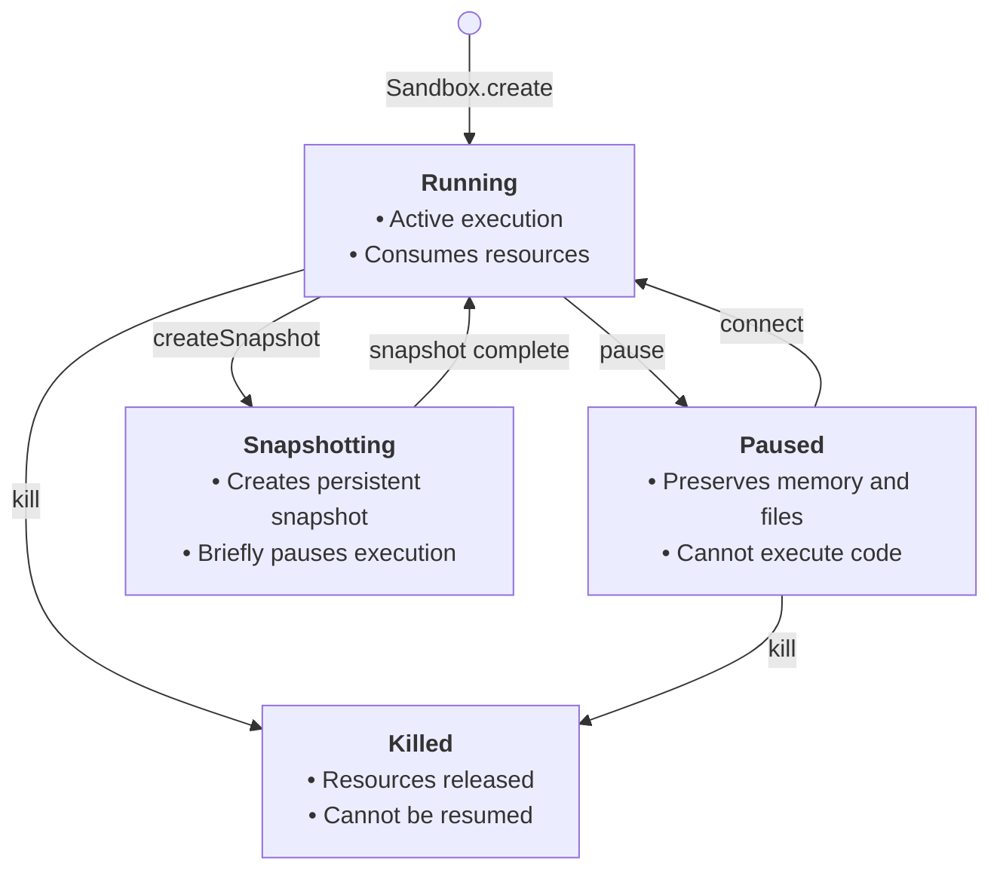

An E2B sandbox is a persistent, secure cloud environment where your AI agents execute code, run commands, manage files, and access the internet. Every sandbox supports **pause and resume** — when a sandbox times out, it can automatically pause and preserve its full state (filesystem and memory), then resume exactly where it left off when activity arrives.



## Key characteristics

- **Persistent by default** — configure `onTimeout: 'pause'` and sandboxes preserve their full state (filesystem + memory) indefinitely. Resume at any time.
- **Auto-resume** — when [enabled](/docs/sandbox/persistence#auto-pause-and-auto-resume), paused sandboxes wake automatically when SDK calls or HTTP traffic arrive. No manual state management needed.
- **Snapshots** — capture a running sandbox's state and spawn multiple new sandboxes from it. Useful for checkpointing, forking, and rollback.
- **Configurable timeouts** — sandboxes run for up to 24 hours (Pro) or 1 hour (Base) continuously. Pausing resets the runtime window.
- **Isolated and secure** — each sandbox runs in its own microVM with network controls, access tokens, and rate limits.

## Quick setup: persistent sandbox

<CodeGroup>
```js JavaScript & TypeScript
import { Sandbox } from 'e2b'

const sandbox = await Sandbox.create({
  timeoutMs: 5 * 60 * 1000,
  lifecycle: {
    onTimeout: 'pause',     // pause instead of kill on timeout
    autoResume: true,        // wake on activity
  },
})

// Use the sandbox — it auto-pauses when idle, auto-resumes when needed
const result = await sandbox.commands.run('echo "Hello from a persistent sandbox"')
console.log(result.stdout)
```
```python Python
from e2b import Sandbox

sandbox = Sandbox.create(
    timeout=5 * 60,
    lifecycle={
        "on_timeout": "pause",   # pause instead of kill on timeout
        "auto_resume": True,     # wake on activity
    },
)

# Use the sandbox — it auto-pauses when idle, auto-resumes when needed
result = sandbox.commands.run('echo "Hello from a persistent sandbox"')
print(result.stdout)
```
</CodeGroup>

## Core

<CardGroup cols={2}>
  <Card title="Lifecycle" icon="rotate" href="/docs/sandbox/lifecycle">
    Timeouts, sandbox info, metadata, listing, connecting, and shutdown.
  </Card>
  <Card title="Pause, resume & snapshots" icon="pause" href="/docs/sandbox/persistence">
    Pause/resume, auto-pause, auto-resume, snapshots, and state transitions.
  </Card>
  <Card title="Commands" icon="terminal" href="/docs/sandbox/commands">
    Run commands, stream output, interactive terminal (PTY), and SSH access.
  </Card>
  <Card title="Filesystem" icon="folder" href="/docs/sandbox/filesystem">
    Read, write, upload, download files and watch for changes.
  </Card>
  <Card title="Volumes" icon="hard-drive" href="/docs/sandbox/volumes">
    Persistent storage that survives sandbox lifecycle.
  </Card>
  <Card title="MCP gateway" icon="plug" href="/docs/sandbox/mcp">
    Connect to 200+ tools through the Model Context Protocol.
  </Card>
  <Card title="Configuration" icon="gear" href="/docs/sandbox/configuration">
    Environment variables and storage bucket integration.
  </Card>
  <Card title="Security" icon="shield" href="/docs/sandbox/security">
    Secured access, network controls, and rate limits.
  </Card>
  <Card title="Observability" icon="chart-line" href="/docs/sandbox/observability">
    Metrics, lifecycle events API, and webhooks.
  </Card>
</CardGroup>

## Guides

<CardGroup cols={3}>
  <Card title="Runtime customization" icon="sliders" href="/docs/sandbox/runtime-customization">
    Install packages, upload files, and configure sandboxes dynamically.
  </Card>
  <Card title="Git integration" icon="code-branch" href="/docs/sandbox/git-integration">
    Clone repos, manage branches, push changes.
  </Card>
  <Card title="Proxy tunneling" icon="network-wired" href="/docs/sandbox/proxy-tunneling">
    Route sandbox traffic through a proxy server.
  </Card>
  <Card title="Custom domain" icon="globe" href="/docs/sandbox/custom-domain">
    Set up a custom domain for sandbox access.
  </Card>
</CardGroup>
