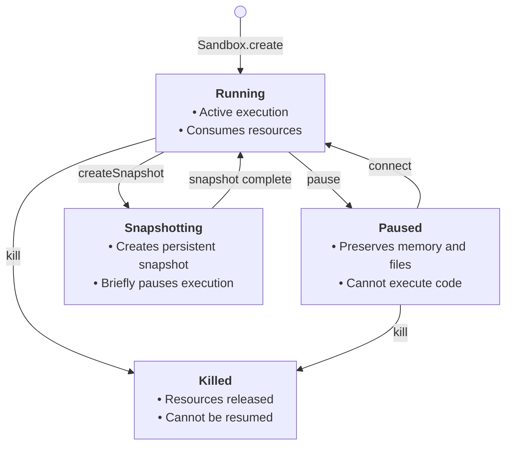
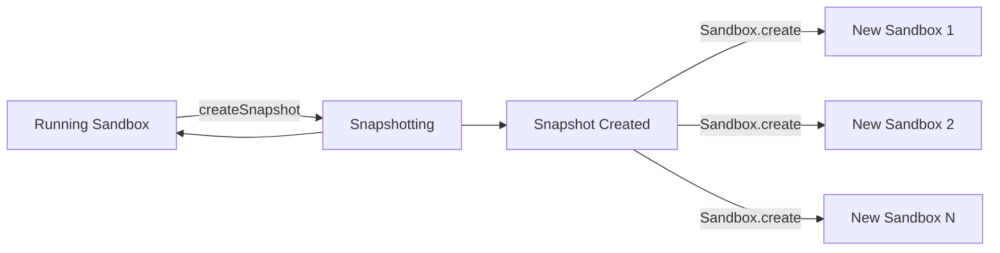

Sandboxes stay running as long as you need them. When their timeout expires, they can automatically pause to save resources — preserving their full state so you can resume at any time. You can also configure an explicit timeout or shut down a sandbox manually.

<Note>
Sandboxes can run continuously for up to 24 hours (Pro) or 1 hour (Base). For longer workloads, use [pause and resume](/docs/sandbox/lifecycle#persistence) — pausing resets the runtime window, and your sandbox's full state is preserved indefinitely.
</Note>

## Timeouts

Every sandbox has a configurable timeout that determines how long it stays running. You set it at creation time in milliseconds (JavaScript) or seconds (Python).

<CodeGroup>
```js JavaScript & TypeScript highlight={6}
import { Sandbox } from '@e2b/code-interpreter'

// Create sandbox with and keep it running for 60 seconds.
// 🚨 Note: The units are milliseconds.
const sandbox = await Sandbox.create({
  timeoutMs: 60_000,
})
```
```python Python highlight={6}
from e2b_code_interpreter import Sandbox

# Create sandbox with and keep it running for 60 seconds.
# 🚨 Note: The units are seconds.
sandbox = Sandbox.create(
  timeout=60,
)
```
</CodeGroup>

### Change timeout at runtime

You can change the sandbox timeout when it's running by calling the `setTimeout` method in JavaScript or `set_timeout` method in Python.

When you call the set timeout method, the sandbox timeout will be reset to the new value that you specified.

This can be useful if you want to extend the sandbox lifetime when it's already running.
You can for example start with a sandbox with 1 minute timeout and then periodically call set timeout every time user interacts with it in your app.

<CodeGroup>
```js JavaScript & TypeScript
import { Sandbox } from '@e2b/code-interpreter'

// Create sandbox with and keep it running for 60 seconds.
const sandbox = await Sandbox.create({ timeoutMs: 60_000 })

// Change the sandbox timeout to 30 seconds.
// 🚨 The new timeout will be 30 seconds from now.
await sandbox.setTimeout(30_000)
```
```python Python
from e2b_code_interpreter import Sandbox

# Create sandbox with and keep it running for 60 seconds.
sandbox = Sandbox.create(timeout=60)

# Change the sandbox timeout to 30 seconds.
# 🚨 The new timeout will be 30 seconds from now.
sandbox.set_timeout(30)
```
</CodeGroup>

## Retrieve sandbox information

You can retrieve sandbox information like sandbox ID, template, metadata, started at/end at date by calling the `getInfo` method in JavaScript or `get_info` method in Python.

<CodeGroup>
```js JavaScript & TypeScript
import { Sandbox } from '@e2b/code-interpreter'

// Create sandbox with and keep it running for 60 seconds.
const sandbox = await Sandbox.create({ timeoutMs: 60_000 })

// Retrieve sandbox information.
const info = await sandbox.getInfo()

console.log(info)

// {
//   "sandboxId": "iiny0783cype8gmoawzmx-ce30bc46",
//   "templateId": "rki5dems9wqfm4r03t7g",
//   "name": "base",
//   "metadata": {},
//   "startedAt": "2025-03-24T15:37:58.076Z",
//   "endAt": "2025-03-24T15:42:58.076Z"
// }
```

```python Python
from e2b_code_interpreter import Sandbox

# Create sandbox with and keep it running for 60 seconds.
sandbox = Sandbox.create(timeout=60)

# Retrieve sandbox information.
info = sandbox.get_info()

print(info)

# SandboxInfo(sandbox_id='ig6f1yt6idvxkxl562scj-419ff533',
#   template_id='u7nqkmpn3jjf1tvftlsu',
#   name='base',
#   metadata={},
#   started_at=datetime.datetime(2025, 3, 24, 15, 42, 59, 255612, tzinfo=tzutc()),
#   end_at=datetime.datetime(2025, 3, 24, 15, 47, 59, 255612, tzinfo=tzutc())
# )
```
</CodeGroup>

## Metadata

Metadata lets you attach arbitrary key-value pairs to a sandbox. This is useful for associating sandboxes with user sessions, storing custom data, or looking up sandboxes later via `Sandbox.list()`.

You specify metadata when creating a sandbox and can access it later through [listing sandboxes](/docs/sandbox/lifecycle#list-sandboxes).

<CodeGroup>
```js JavaScript & TypeScript highlight={6}
import { Sandbox } from '@e2b/code-interpreter'

// Create sandbox with metadata.
const sandbox = await Sandbox.create({
  metadata: {
    userId: '123',
  },
})

// List running sandboxes and access metadata.
const paginator = await Sandbox.list()
const runningSandboxes = await paginator.nextItems()
// Will print:
// {
//   'userId': '123',
// }
console.log(runningSandboxes[0].metadata)
```
```python Python highlight={6}
from e2b_code_interpreter import Sandbox

# Create sandbox with metadata.
sandbox = Sandbox.create(
  metadata={
    'userId': '123',
  },
)

# List running sandboxes and access metadata.
paginator = Sandbox.list()
running_sandboxes = paginator.next_items()
# Will print:
# {
#   'userId': '123',
# }
print(running_sandboxes[0].metadata)
```
</CodeGroup>

You can also [filter sandboxes by metadata](/docs/sandbox/lifecycle#filter-sandboxes).

## List sandboxes

You can list sandboxes using the `Sandbox.list()` method. The method supports pagination and returns both running and paused sandboxes.

<Note>
    Once you have information about a running sandbox, you can [connect](/docs/sandbox/lifecycle#connect-to-a-sandbox) to it using the `Sandbox.connect()` method.
</Note>

<CodeGroup>
    ```js JavaScript & TypeScript highlight={6,11,14,24}
    import { Sandbox, SandboxInfo } from '@e2b/code-interpreter'

    const sandbox = await Sandbox.create(
      {
        metadata: {
          name: 'My Sandbox',
        },
      },
    )

    const paginator = Sandbox.list()

    // Get the first page of sandboxes (running and paused)
    const firstPage = await paginator.nextItems()

    const runningSandbox = firstPage[0]

    console.log('Running sandbox metadata:', runningSandbox.metadata)
    console.log('Running sandbox id:', runningSandbox.sandboxId)
    console.log('Running sandbox started at:', runningSandbox.startedAt)
    console.log('Running sandbox template id:', runningSandbox.templateId)

    // Get the next page of sandboxes
    const nextPage = await paginator.nextItems()
    ```
    ```python Python highlight={5,9,12,22}
    from e2b_code_interpreter import Sandbox, SandboxInfo

    sandbox = Sandbox.create(
        metadata={
            "name": "My Sandbox",
        },
    )

    paginator = Sandbox.list()

    # Get the first page of sandboxes (running and paused)
    firstPage = paginator.next_items()

    running_sandbox = firstPage[0]

    print('Running sandbox metadata:', running_sandbox.metadata)
    print('Running sandbox id:', running_sandbox.sandbox_id)
    print('Running sandbox started at:', running_sandbox.started_at)
    print('Running sandbox template id:', running_sandbox.template_id)

    # Get the next page of sandboxes
    nextPage = paginator.next_items()
    ```
</CodeGroup>

### Filter sandboxes

Filter sandboxes by their current state. The state parameter can contain either "**running**" for running sandboxes or "**paused**" for paused sandboxes, or both.

<CodeGroup>
    ```js JavaScript & TypeScript highlight={9,13}
    import { Sandbox } from '@e2b/code-interpreter'

    // Create a sandbox.
    const sandbox = await Sandbox.create()

    // List sandboxes that are running or paused.
    const paginator = Sandbox.list({
      query: {
        state: ['running', 'paused'],
      },
    })

    const sandboxes = await paginator.nextItems()
    ```
    ```python Python highlight={9,14}
    from e2b_code_interpreter import Sandbox, SandboxQuery, SandboxState

    # Create a sandbox with metadata.
    sandbox = Sandbox.create()

    # List sandboxes that are running or paused.
    paginator = Sandbox.list(
        query=SandboxQuery(
            state=[SandboxState.RUNNING, SandboxState.PAUSED],
        ),
    )

    # Get the first page of sandboxes (running and paused)
    sandboxes = paginator.next_items()
    ```
</CodeGroup>

You can also filter sandboxes by metadata key-value pairs specified during creation.

<CodeGroup>
    ```js JavaScript & TypeScript highlight={6-8,15,18}
    import { Sandbox } from '@e2b/code-interpreter'

    // Create sandbox with metadata.
    const sandbox = await Sandbox.create({
      metadata: {
        env: 'dev',
        app: 'my-app',
        userId: '123',
      },
    })

    // List all sandboxes that has `userId` key with value `123` and `env` key with value `dev`.
    const paginator = Sandbox.list({
      query: {
        metadata: { userId: '123', env: 'dev' },
      },
    })

    const sandboxes = await paginator.nextItems()
    ```
    ```python Python highlight={6-8,16-17}
    from e2b_code_interpreter import Sandbox, SandboxQuery, SandboxState

    # Create sandbox with metadata.
    sandbox = Sandbox.create(
        metadata={
            "env": "dev",
            "app": "my-app",
            "user_id": "123",
        },
    )

    # List running sandboxes that has `userId` key with value `123` and `env` key with value `dev`.
    paginator = Sandbox.list(
        query=SandboxQuery(
            metadata={
                "userId": "123",
                "env": "dev",
            }
        ),
    )

    # Get the first page of sandboxes (running and paused)
    sandboxes = paginator.next_items()
    ```
</CodeGroup>

### Advanced pagination

For more granular pagination, you can set custom per-page item limit (default and maximum is **100**) and specify an offset parameter (`nextToken` or `next_token`) to start paginating from.

<CodeGroup>
    ```js JavaScript & TypeScript highlight={4-5,16}
    import { Sandbox } from '@e2b/code-interpreter'

    const paginator = Sandbox.list({
      limit: 100,
      nextToken: '<base64-encoded-token>',
    })

    // Additional paginator properties
    // Whether there is a next page
    paginator.hasNext

    // Next page token
    paginator.nextToken

    // Fetch the next page
    await paginator.nextItems()
    ```
    ```python Python  highlight={5-6,13}
    from e2b_code_interpreter import Sandbox

    # List running sandboxes that has `userId` key with value `123` and `env` key with value `dev`.
    paginator = Sandbox.list(
        limit=100,
        next_token="<base64-encoded-token>",
    )

    paginator.has_next  # Whether there is a next page
    paginator.next_token  # Next page token

    # Fetch the next page
    paginator.next_items()
    ```
</CodeGroup>

You can fetch all pages by looping through the paginator while checking if there is a next page (using `hasNext` or `has_next` property) and fetching until there are no more pages left to fetch:

<CodeGroup>
    ```js JavaScript & TypeScript  highlight={7}
    import { Sandbox } from '@e2b/code-interpreter'

    const paginator = Sandbox.list()

    // Loop through all pages
    const sandboxes: SandboxInfo[] = []
    while (paginator.hasNext) {
      const items = await paginator.nextItems()
      sandboxes.push(...items)
    }
    ```
    ```python Python highlight={7}
    from e2b_code_interpreter import Sandbox, SandboxQuery

    paginator = Sandbox.list()

    # Loop through all pages
    sandboxes: list[SandboxInfo] = []
    while paginator.has_next:
        items = paginator.next_items()
        sandboxes.extend(items)
    ```
</CodeGroup>

## Connect to a sandbox

If you have a running sandbox, you can connect to it using the `Sandbox.connect()` method and start controlling it with the SDK. This is useful for reusing the same sandbox instance after a period of inactivity, or for resuming a paused sandbox.

### 1. Get the sandbox ID

To connect to a running sandbox, you first need to retrieve its ID. You can do this by calling the `Sandbox.list()` method.

<CodeGroup>
```js JavaScript & TypeScript
import { Sandbox } from '@e2b/code-interpreter'

const sbx = await Sandbox.create()

// Get all running sandboxes
const paginator = await Sandbox.list({
  query: { state: ['running'] },
})

const runningSandboxes = await paginator.nextItems()
if (runningSandboxes.length === 0) {
  throw new Error('No running sandboxes found')
}

// Get the ID of the sandbox you want to connect to
const sandboxId = runningSandboxes[0].sandboxId
```

```python Python
from e2b_code_interpreter import Sandbox

sbx = Sandbox.create()

# Get all running sandboxes
paginator = Sandbox.list()

# Get the ID of the sandbox you want to connect to
running_sandboxes = paginator.next_items()
if len(running_sandboxes) == 0:
    raise Exception("No running sandboxes found")

# Get the ID of the sandbox you want to connect to
sandbox_id = running_sandboxes[0].sandbox_id
```
</CodeGroup>

### 2. Connect to the sandbox

Now that you have the sandbox ID, you can connect to the sandbox using the `Sandbox.connect()` method.

<CodeGroup>
```js JavaScript & TypeScript highlight={3}
import { Sandbox } from '@e2b/code-interpreter'

const sandbox = await Sandbox.connect(sandboxId)

// Now you can use the sandbox as usual
// ...
const result = await sandbox.commands.run("whoami")
console.log(`Running in sandbox ${sandbox.sandboxId} as "${result.stdout.trim()}"`)
```

```python Python highlight={3}
from e2b_code_interpreter import Sandbox

sandbox = Sandbox.connect(sandbox_id)

# Now you can use the sandbox as usual
# ...
r = sandbox.commands.run("whoami")
print(f"Running in sandbox {sandbox.sandbox_id} as \"{r.stdout.strip()}\"")
```
</CodeGroup>

## Persistence

The sandbox persistence allows you to pause your sandbox and resume it later from the same state it was in when you paused it. This includes not only state of the sandbox's filesystem but also the sandbox's memory — all running processes, loaded variables, data, etc.

### Sandbox state transitions

Understanding how sandboxes transition between different states is crucial for managing their lifecycle effectively. Here's a diagram showing the possible state transitions:



#### State descriptions

- **Running**: The sandbox is actively running and can execute code. This is the initial state after creation.
- **Paused**: The sandbox execution is suspended but its state is preserved.
- **Snapshotting**: The sandbox is briefly paused while a persistent snapshot is being created. It automatically returns to Running. See [Snapshots](/docs/sandbox/lifecycle#snapshots).
- **Killed**: The sandbox is terminated and all resources are released. This is a terminal state.

#### Changing sandbox state

<CodeGroup>
```js JavaScript & TypeScript
import { Sandbox } from '@e2b/code-interpreter'

const sandbox = await Sandbox.create() // Starts in Running state

// Pause the sandbox
await sandbox.pause() // Running → Paused

// Resume the sandbox
await sandbox.connect() // Running/Paused → Running

// Kill the sandbox (from any state)
await sandbox.kill() // Running/Paused → Killed
```

```python Python
from e2b_code_interpreter import Sandbox

sandbox = Sandbox.create()  # Starts in Running state

# Pause the sandbox
sandbox.pause()  # Running → Paused

# Resume the sandbox
sandbox.connect()  # Running/Paused → Running

# Kill the sandbox (from any state)
sandbox.kill()  # Running/Paused → Killed
```
</CodeGroup>

### Pausing sandbox

When you pause a sandbox, both the sandbox's filesystem and memory state will be saved. This includes all the files in the sandbox's filesystem and all the running processes, loaded variables, data, etc.

<CodeGroup>
```js JavaScript & TypeScript highlight={8-9}
import { Sandbox } from '@e2b/code-interpreter'

const sbx = await Sandbox.create()
console.log('Sandbox created', sbx.sandboxId)

// Pause the sandbox
// You can save the sandbox ID in your database to resume the sandbox later
await sbx.pause()
console.log('Sandbox paused', sbx.sandboxId)
```
```python Python highlight={8-9}
from e2b_code_interpreter import Sandbox

sbx = Sandbox.create()
print('Sandbox created', sbx.sandbox_id)

# Pause the sandbox
# You can save the sandbox ID in your database to resume the sandbox later
sbx.pause()
print('Sandbox paused', sbx.sandbox_id)
```
</CodeGroup>


### Resuming sandbox

When you resume a sandbox, it will be in the same state it was in when you paused it.
This means that all the files in the sandbox's filesystem will be restored and all the running processes, loaded variables, data, etc. will be restored.

<CodeGroup>
```js JavaScript & TypeScript highlight={12-13}
import { Sandbox } from '@e2b/code-interpreter'

const sbx = await Sandbox.create()
console.log('Sandbox created', sbx.sandboxId)

// Pause the sandbox
// You can save the sandbox ID in your database to resume the sandbox later
await sbx.pause()
console.log('Sandbox paused', sbx.sandboxId)

// Connect to the sandbox (it will automatically resume the sandbox, if paused)
const sameSbx = await sbx.connect()
console.log('Connected to the sandbox', sameSbx.sandboxId)
```
```python Python highlight={12-13}
from e2b_code_interpreter import Sandbox

sbx = Sandbox.create()
print('Sandbox created', sbx.sandbox_id)

# Pause the sandbox
# You can save the sandbox ID in your database to resume the sandbox later
sbx.pause()
print('Sandbox paused', sbx.sandbox_id)

# Connect to the sandbox (it will automatically resume the sandbox, if paused)
same_sbx = sbx.connect()
print('Connected to the sandbox', same_sbx.sandbox_id)
```
</CodeGroup>

### Listing paused sandboxes

You can list all paused sandboxes by calling the `Sandbox.list` method and supplying the `state` query parameter.

<CodeGroup>
```js JavaScript & TypeScript highlight={4,7}
import { Sandbox, SandboxInfo } from '@e2b/code-interpreter'

// List all paused sandboxes
const paginator = Sandbox.list({ query: { state: ['paused'] } })

// Get the first page of paused sandboxes
const sandboxes = await paginator.nextItems()

// Get all paused sandboxes
while (paginator.hasNext) {
  const items = await paginator.nextItems()
  sandboxes.push(...items)
}
```
```python Python highlight={4,7}
# List all paused sandboxes
from e2b_code_interpreter import Sandbox, SandboxQuery, SandboxState

paginator = Sandbox.list(SandboxQuery(state=[SandboxState.PAUSED]))

# Get the first page of paused sandboxes
sandboxes = paginator.next_items()

# Get all paused sandboxes
while paginator.has_next:
  items = paginator.next_items()
  sandboxes.extend(items)
```
</CodeGroup>

### Removing paused sandboxes

You can remove paused sandboxes by calling the `kill` method on the Sandbox instance.

<CodeGroup>
```js JavaScript & TypeScript highlight={11,14}
import { Sandbox } from '@e2b/code-interpreter'

const sbx = await Sandbox.create()
console.log('Sandbox created', sbx.sandboxId)

// Pause the sandbox
// You can save the sandbox ID in your database to resume the sandbox later
await sbx.pause()

// Remove the sandbox
await sbx.kill()

// Remove sandbox by id
await Sandbox.kill(sbx.sandboxId)
```
```python Python highlight={9,12}
from e2b_code_interpreter import Sandbox

sbx = Sandbox.create()

# Pause the sandbox
sbx.pause()

# Remove the sandbox
sbx.kill()

# Remove sandbox by id
Sandbox.kill(sbx.sandbox_id)
```
</CodeGroup>

### Timeout on connect

When you connect to a sandbox, the inactivity timeout resets. The default is 5 minutes, but you can pass a custom timeout to the `Sandbox.connect()` method:

<CodeGroup>
```js JavaScript & TypeScript
import { Sandbox } from '@e2b/code-interpreter'

const sbx = await Sandbox.connect(sandboxId, { timeoutMs: 60 * 1000 }) // 60 seconds
```
```python Python
from e2b_code_interpreter import Sandbox

sbx = Sandbox.connect(sandbox_id, timeout=60) # 60 seconds
```
</CodeGroup>

### Auto-pause

Auto-pause is configured in the sandbox lifecycle on create. Set `onTimeout`/`on_timeout` to `pause`.

<CodeGroup>
```js JavaScript & TypeScript
import { Sandbox } from 'e2b'

const sandbox = await Sandbox.create({
  timeoutMs: 10 * 60 * 1000, // Optional: change default timeout (10 minutes)
  lifecycle: {
    onTimeout: 'pause',
    autoResume: false, // Optional (default is false)
  },
})
```
```python Python
from e2b import Sandbox

sandbox = Sandbox.create(
    timeout=10 * 60,  # Optional: change default timeout (10 minutes)
    lifecycle={
        "on_timeout": "pause", # Auto-pause after the sandbox times out
        "auto_resume": False,  # Optional (default is False)
    },
)
```
</CodeGroup>

Auto-pause is persistent, meaning if your sandbox resumes and later times out again, it will pause again.

If you call `.kill()`, the sandbox is permanently deleted and cannot be resumed.

### Network behavior during pause

If you have a service (for example a server) running inside your sandbox and you pause the sandbox, the service won't be accessible from the outside and all the clients will be disconnected.
If you resume the sandbox, the service will be accessible again but you need to connect clients again.

### Limitations

#### Pause and resume performance
- Pausing a sandbox takes approximately **4 seconds per 1 GiB of RAM**
- Resuming a sandbox takes approximately **1 second**

#### Paused sandbox retention
- Paused sandboxes are kept **indefinitely** — there is no automatic deletion or time-to-live limit
- You can resume a paused sandbox at any time

#### Continuous runtime limits
- A sandbox can remain running (without being paused) for:
  - **24 hours** on the **Pro tier**
  - **1 hour** on the **Base tier**
- After a sandbox is paused and resumed, the continuous runtime limit is **reset**

## AutoResume

Many workloads don't need a sandbox running all the time, but when they do need it, it should just work, whether it was paused or not.

`AutoResume` handles this automatically: a paused sandbox wakes up when activity arrives, so your code does not have to check or manage sandbox state.
Configure it through the `lifecycle` object when creating a sandbox.

### Configure lifecycle on create

<CodeGroup>
```js JavaScript & TypeScript
import { Sandbox } from 'e2b'

const sandbox = await Sandbox.create({
  timeoutMs: 10 * 60 * 1000,
  lifecycle: {
    onTimeout: 'pause',
    autoResume: true, // resume when activity arrives
  },
})
```
```python Python
from e2b import Sandbox

sandbox = Sandbox.create(
    timeout=10 * 60,
    lifecycle={
        "on_timeout": "pause",
        "auto_resume": True,  # resume when activity arrives
    },
)
```
</CodeGroup>

### Lifecycle options

- `onTimeout` / `on_timeout`
  - `kill` (default): sandbox is terminated when timeout is reached
  - `pause`: sandbox is paused when timeout is reached
- `autoResume` / `auto_resume`
  - `false` (default): paused sandboxes do not auto-resume
  - `true`: paused sandboxes auto-resume on activity
  - `true` is valid only when `onTimeout`/`on_timeout` is `pause`

### Behavior summary

- Default behavior is equivalent to `onTimeout: "kill"` with `autoResume: false`.
- `onTimeout: "pause"` with `autoResume: false` gives auto-pause without auto-resume.
- `onTimeout: "pause"` with `autoResume: true` gives auto-pause with auto-resume.
- `Sandbox.connect()` can still be used to resume a paused sandbox manually.

If you use `autoResume: false`, resume explicitly with `Sandbox.connect()`.

### What counts as activity

Auto-resume is triggered by the sandbox activity - that's both HTTP traffic and controlling the sandbox from the SDK.

That includes SDK operations like:
- `sandbox.commands.run(...)`
- `sandbox.files.read(...)`
- `sandbox.files.write(...)`
- opening a tunneled app URL or sending requests to a service running inside the sandbox

If a sandbox is paused and `autoResume` is enabled, the next supported operation resumes it automatically. You do not need to call `Sandbox.connect()` first.

#### SDK example: pause, then read a file

<CodeGroup>
```js JavaScript & TypeScript
import { Sandbox } from 'e2b'

const sandbox = await Sandbox.create({
  timeoutMs: 10 * 60 * 1000,
  lifecycle: {
    onTimeout: 'pause',
    autoResume: true,
  },
})

await sandbox.files.write('/home/user/hello.txt', 'hello from a paused sandbox')
await sandbox.pause()

const content = await sandbox.files.read('/home/user/hello.txt')
console.log(content)
console.log(`State after read: ${(await sandbox.getInfo()).state}`)
```
```python Python
from e2b import Sandbox

sandbox = Sandbox.create(
    timeout=10 * 60,
    lifecycle={
        "on_timeout": "pause",
        "auto_resume": True,
    },
)

sandbox.files.write("/home/user/hello.txt", "hello from a paused sandbox")
sandbox.pause()

content = sandbox.files.read("/home/user/hello.txt")
print(content)
print(f"State after read: {sandbox.get_info().state}")
```
</CodeGroup>

### AutoResume use cases

#### Web and dev/preview servers

Use `onTimeout: "pause"` + `autoResume: true` so inbound traffic can wake a paused sandbox automatically.
This works for both basic web/API servers and dev or preview servers you open occasionally.

<CodeGroup>
```js JavaScript & TypeScript
import { Sandbox } from 'e2b'

const sandbox = await Sandbox.create({
  timeoutMs: 10 * 60 * 1000,
  lifecycle: {
    onTimeout: 'pause',
    autoResume: true,
  },
})

await sandbox.commands.run(
  `python3 -m pip -q install 'flask>=2.2'`
)

await sandbox.files.write(
  '/home/user/app.py',
  [
    'from flask import Flask',
    'app = Flask(__name__)',
    '@app.route("/")',
    'def hello():',
    '    return "Hello, World!"',
    'app.run(host="0.0.0.0", port=3000)',
    '',
  ].join('\n')
)

await sandbox.commands.run(
  'python3 -u /home/user/app.py > /home/user/flask.log 2>&1',
  { background: true }
)

await new Promise((resolve) => setTimeout(resolve, 1000))

const previewHost = sandbox.getHost(3000)
console.log(`Preview URL: https://${previewHost}`)

console.log(`Status before pause: ${(await sandbox.getInfo()).state}`)
await sandbox.pause()
console.log(`Status after pause: ${(await sandbox.getInfo()).state}`)
```
```python Python
import time

from e2b import Sandbox

sandbox = Sandbox.create(
    timeout=10 * 60,
    lifecycle={
        "on_timeout": "pause",
        "auto_resume": True,
    },
)

sandbox.commands.run("python3 -m pip -q install 'flask>=2.2'")

sandbox.files.write(
    "/home/user/app.py",
    'from flask import Flask\n'
    'app = Flask(__name__)\n'
    '@app.route("/")\n'
    'def hello():\n'
    '    return "Hello, World!"\n'
    'app.run(host="0.0.0.0", port=3000)\n'
)

sandbox.commands.run(
    "python3 -u /home/user/app.py > /home/user/flask.log 2>&1",
    background=True,
)

time.sleep(1)

preview_host = sandbox.get_host(3000)
print(f"Preview URL: https://{preview_host}")

print(f"Status before pause: {sandbox.get_info().state}")
sandbox.pause()
print(f"Status after pause: {sandbox.get_info().state}")
```
</CodeGroup>

#### Agent/tool execution

For queued tasks or tool calls, create once and keep using the same sandbox handle. If it is paused, it will auto-resume when you run the next command.

<CodeGroup>
```js JavaScript & TypeScript
import { Sandbox } from 'e2b'

// One-time setup
const sandbox = await Sandbox.create({
  timeoutMs: 5 * 60 * 1000,
  lifecycle: {
    onTimeout: 'pause',
    autoResume: true,
  },
})

// Later: called for each agent/tool task
async function runToolTask(command) {
  const result = await sandbox.commands.run(command)
  return result.stdout
}

console.log(await runToolTask('python -c "print(2 + 2)"'))
```
```python Python
from e2b import Sandbox

# One-time setup
sandbox = Sandbox.create(
    timeout=5 * 60,
    lifecycle={
        "on_timeout": "pause",
        "auto_resume": True,
    },
)

# Later: called for each agent/tool task
def run_tool_task(command: str) -> str:
    result = sandbox.commands.run(command)
    return result.stdout

print(run_tool_task('python -c "print(2 + 2)"'))
```
</CodeGroup>

#### Per-user sandboxes

For multi-tenant apps, keep a map of sandbox IDs by user. On each request, connect to the user's existing sandbox (which auto-resumes if paused) or create a new one.

<CodeGroup>
```js JavaScript & TypeScript
import { Sandbox } from 'e2b'

const userSandboxes = new Map() // userId → Sandbox

async function getSandbox(userId) {
  let sandbox = userSandboxes.get(userId)

  if (!sandbox) {
    sandbox = await Sandbox.create({
      timeoutMs: 5 * 60 * 1000,
      lifecycle: {
        onTimeout: 'pause',
        autoResume: true,
      },
    })
    userSandboxes.set(userId, sandbox)
  }

  return sandbox
}

// On each user request (auto-resumes if paused)
const sandbox = await getSandbox('user-123')
const result = await sandbox.commands.run('echo "Hello from your sandbox"')
console.log(result.stdout)
```
```python Python
from e2b import Sandbox

user_sandboxes: dict[str, Sandbox] = {}  # user_id → Sandbox

def get_sandbox(user_id: str) -> Sandbox:
    if user_id not in user_sandboxes:
        user_sandboxes[user_id] = Sandbox.create(
            timeout=5 * 60,
            lifecycle={
                "on_timeout": "pause",
                "auto_resume": True,
            },
        )

    return user_sandboxes[user_id]

# On each user request (auto-resumes if paused)
sandbox = get_sandbox("user-123")
result = sandbox.commands.run('echo "Hello from your sandbox"')
print(result.stdout)
```
</CodeGroup>

### AutoResume cleanup

Auto-resume is persistent, meaning if your sandbox resumes and later times out again, it will pause again.

If you call `.kill()`, the sandbox is permanently deleted and cannot be resumed.

## Snapshots

Snapshots let you create a persistent point-in-time capture of a running sandbox, including both its filesystem and memory state.
You can then use a snapshot to spawn new sandboxes that start from the exact same state.

The original sandbox continues running after the snapshot is created, and a single snapshot can be used to create many new sandboxes.

### Prerequisites

Snapshots require templates with envd version `v0.5.0` or above. If you are using a custom template created before envd `v0.5.0`, you need to rebuild it.

You can check the template envd version using the `e2b template list` command or by viewing the templates list on the dashboard.

### Snapshots vs. Pause/Resume

| | Pause/Resume | Snapshots |
|---|---|---|
| Effect on original sandbox | Pauses (stops) the sandbox | Sandbox briefly pauses, then continues running |
| Relationship | One-to-one — resume restores the same sandbox | One-to-many — snapshot can spawn many new sandboxes |
| Use case | Suspend and resume a single sandbox | Create a reusable checkpoint |

### Snapshot flow



The sandbox is briefly paused during the snapshot process but automatically returns to running state. The sandbox ID stays the same after the snapshot completes.

<Warning>
During the snapshot, the sandbox is temporarily paused and resumed. This causes all active connections (e.g. WebSocket, PTY, command streams) to be dropped. Make sure your client handles reconnection properly.
</Warning>

### Create a snapshot

You can create a snapshot from a running sandbox instance.

<CodeGroup>
```js JavaScript & TypeScript
import { Sandbox } from 'e2b'

const sandbox = await Sandbox.create()

// Create a snapshot from a running sandbox
const snapshot = await sandbox.createSnapshot()
console.log('Snapshot ID:', snapshot.snapshotId)
```
```python Python
from e2b import Sandbox

sandbox = Sandbox.create()

# Create a snapshot from a running sandbox
snapshot = sandbox.create_snapshot()
print('Snapshot ID:', snapshot.snapshot_id)
```
</CodeGroup>

You can also create a snapshot by sandbox ID using the static method.

<CodeGroup>
```js JavaScript & TypeScript
import { Sandbox } from 'e2b'

// Create a snapshot by sandbox ID
const snapshot = await Sandbox.createSnapshot(sandboxId)
console.log('Snapshot ID:', snapshot.snapshotId)
```
```python Python
from e2b import Sandbox

# Create a snapshot by sandbox ID
snapshot = Sandbox.create_snapshot(sandbox_id)
print('Snapshot ID:', snapshot.snapshot_id)
```
</CodeGroup>

### Create a sandbox from a snapshot

The snapshot ID can be used directly with `Sandbox.create()` to spawn a new sandbox from the snapshot. The new sandbox starts with the exact filesystem and memory state captured in the snapshot.

<CodeGroup>
```js JavaScript & TypeScript highlight={5}
import { Sandbox } from 'e2b'

const snapshot = await sandbox.createSnapshot()

// Create a new sandbox from the snapshot
const newSandbox = await Sandbox.create(snapshot.snapshotId)
```
```python Python highlight={5}
from e2b import Sandbox

snapshot = sandbox.create_snapshot()

# Create a new sandbox from the snapshot
new_sandbox = Sandbox.create(snapshot.snapshot_id)
```
</CodeGroup>

### List snapshots

You can list all snapshots. The method returns a paginator for iterating through results.

<CodeGroup>
```js JavaScript & TypeScript
import { Sandbox } from 'e2b'

const paginator = Sandbox.listSnapshots()

const snapshots = []
while (paginator.hasNext) {
  const items = await paginator.nextItems()
  snapshots.push(...items)
}
```
```python Python
from e2b import Sandbox

paginator = Sandbox.list_snapshots()

snapshots = []
while paginator.has_next:
    items = paginator.next_items()
    snapshots.extend(items)
```
</CodeGroup>

#### Filter by sandbox

You can filter snapshots created from a specific sandbox.

<CodeGroup>
```js JavaScript & TypeScript
import { Sandbox } from 'e2b'

const paginator = Sandbox.listSnapshots({ sandboxId: 'your-sandbox-id' })
const snapshots = await paginator.nextItems()
```
```python Python
from e2b import Sandbox

paginator = Sandbox.list_snapshots(sandbox_id="your-sandbox-id")
snapshots = paginator.next_items()
```
</CodeGroup>

### Delete a snapshot

<CodeGroup>
```js JavaScript & TypeScript
import { Sandbox } from 'e2b'

// Returns true if deleted, false if the snapshot was not found
const deleted = await Sandbox.deleteSnapshot(snapshot.snapshotId)
```
```python Python
from e2b import Sandbox

Sandbox.delete_snapshot(snapshot.snapshot_id)
```
</CodeGroup>

### Snapshots vs. Templates

Both snapshots and [templates](/docs/template/quickstart) create reusable starting points for sandboxes, but they solve different problems.

| | Templates | Snapshots |
|---|---|---|
| Defined by | Declarative code (Template builder) | Capturing a running sandbox |
| Reproducibility | Same definition produces the same sandbox every time | Captures whatever state exists at that moment |
| Best for | Repeatable base environments | Checkpointing, rollback, forking runtime state |

Use templates when every sandbox should start from an identical, known state — pre-installed tools, fixed configurations, consistent environments.
Use snapshots when you need to capture or fork live runtime state that depends on what happened during execution.

### Snapshot use cases

- **Checkpointing agent work** — an AI agent has loaded data and produced partial results in memory. Snapshot it so you can resume or fork from that point later.
- **Rollback points** — snapshot before a risky or expensive operation (running untrusted code, applying a migration, refactoring a web app). If it fails, rollback - spawn a fresh sandbox from the snapshot before the operation happened.
- **Forking workflows** — spawn multiple sandboxes from the same snapshot to explore different approaches in parallel.
- **Cached sandboxes** — avoid repeating expensive setup by snapshotting a sandbox that has already loaded a large dataset or started a long-running process.
- **Sharing state** — one user or agent configures an environment interactively, snapshots it, and others start from that exact state.

## Shutdown sandbox

You can shutdown the sandbox any time even before the timeout is up by calling the `kill` method.

<CodeGroup>
```js JavaScript & TypeScript
import { Sandbox } from '@e2b/code-interpreter'

// Create sandbox with and keep it running for 60 seconds.
const sandbox = await Sandbox.create({ timeoutMs: 60_000 })

// Shutdown the sandbox immediately.
await sandbox.kill()
```
```python Python
from e2b_code_interpreter import Sandbox

# Create sandbox with and keep it running for 60 seconds.
sandbox = Sandbox.create(timeout=60)

# Shutdown the sandbox immediately.
sandbox.kill()
```
</CodeGroup>
