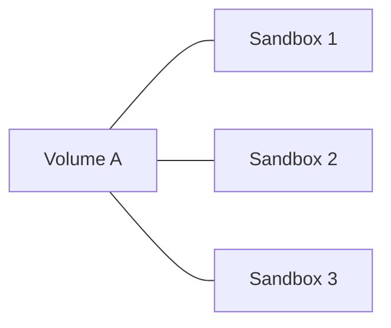
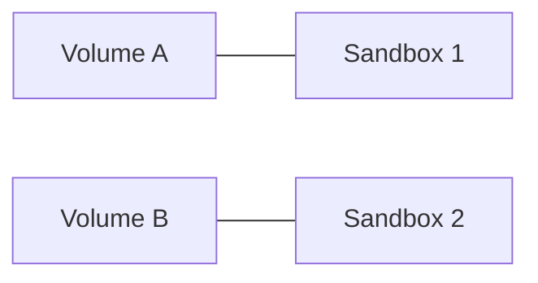
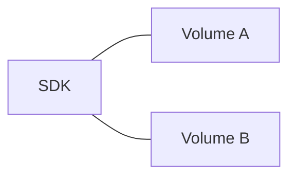

<Note>
Volumes are currently in private beta.
If you'd like access, please reach out to us at [support@e2b.dev](mailto:support@e2b.dev).
</Note>

Volumes provide persistent storage that exists independently of sandbox lifecycles. Data written to a volume persists even after a sandbox is shut down, and the same volume can be mounted to multiple sandboxes — either at the same time for shared state across parallel agents, or sequentially to resume work in a new sandbox. You can also read and write to a volume directly through the SDK without mounting it to any sandbox.

**One volume shared across multiple sandboxes**



**Each sandbox with its own volume**



**Standalone usage via SDK**



When a volume is mounted to a sandbox, files can be read and written directly at the mount path using the regular sandbox filesystem API. The `Volume` SDK methods covered below are meant for working with a volume when it is not mounted to any sandbox.

## Quickstart

Create a volume and mount it to a sandbox. Any file written under the mount path is persisted in the volume and remains available to future sandboxes.

<CodeGroup>
```js JavaScript & TypeScript
import { Volume, Sandbox } from 'e2b'

const volume = await Volume.create('my-volume')

const sandbox = await Sandbox.create({
  volumeMounts: {
    '/mnt/my-data': volume,
  },
})
```
```python Python
from e2b import Volume, Sandbox

volume = Volume.create('my-volume')

sandbox = Sandbox.create(
    volume_mounts={
        '/mnt/my-data': volume,
    },
)
```
</CodeGroup>

## Managing volumes

The `Volume` class exposes lifecycle operations for creating, listing, inspecting, and destroying volumes.

### Create a volume

Create a new named volume. Volume names can only contain letters, numbers, and hyphens.

<CodeGroup>
```js JavaScript & TypeScript
import { Volume } from 'e2b'

const volume = await Volume.create('my-volume')
console.log(volume.volumeId) // Volume ID
console.log(volume.name)     // 'my-volume'
```
```python Python
from e2b import Volume

volume = Volume.create('my-volume')
print(volume.volume_id)  # Volume ID
print(volume.name)       # 'my-volume'
```
</CodeGroup>

### Connect to an existing volume

Use `connect()` to get a handle to an existing volume by its ID. This is how you reach a volume that was created in a previous session.

<CodeGroup>
```js JavaScript & TypeScript
import { Volume } from 'e2b'

const volume = await Volume.connect('volume-id')
console.log(volume.volumeId) // Volume ID
console.log(volume.name)     // Volume name
```
```python Python
from e2b import Volume

volume = Volume.connect('volume-id')
print(volume.volume_id)  # Volume ID
print(volume.name)       # Volume name
```
</CodeGroup>

### List volumes

List all volumes in your team.

<CodeGroup>
```js JavaScript & TypeScript
import { Volume } from 'e2b'

const volumes = await Volume.list()
console.log(volumes)
// [{ volumeId: '...', name: 'my-volume' }, ...]
```
```python Python
from e2b import Volume

volumes = Volume.list()
print(volumes)
# [VolumeInfo(volume_id='...', name='my-volume'), ...]
```
</CodeGroup>

### Get volume info

Fetch metadata for a single volume by ID.

<CodeGroup>
```js JavaScript & TypeScript
import { Volume } from 'e2b'

const info = await Volume.getInfo('volume-id')
console.log(info)
// { volumeId: '...', name: 'my-volume' }
```
```python Python
from e2b import Volume

info = Volume.get_info('volume-id')
print(info)
# VolumeInfo(volume_id='...', name='my-volume')
```
</CodeGroup>

### Destroy a volume

Permanently delete a volume and all of its contents. This cannot be undone.

<CodeGroup>
```js JavaScript & TypeScript
import { Volume } from 'e2b'

const success = await Volume.destroy('volume-id')
console.log(success) // true
```
```python Python
from e2b import Volume

success = Volume.destroy('volume-id')
print(success)  # True
```
</CodeGroup>

## Mounting volumes to a sandbox

Pass `volumeMounts` / `volume_mounts` to `Sandbox.create()` to attach one or more volumes when the sandbox starts. Keys are the mount paths inside the sandbox; values are either a `Volume` object or the volume name.

<CodeGroup>
```js JavaScript & TypeScript
import { Volume, Sandbox } from 'e2b'

const volume = await Volume.create('my-volume')

// You can pass a Volume object
const sandbox = await Sandbox.create({
  volumeMounts: {
    '/mnt/my-data': volume,
  },
})

// Or pass the volume name directly
const sandbox = await Sandbox.create({
  volumeMounts: {
    '/mnt/my-data': 'my-volume',
  },
})

// Files written to /mnt/my-data inside the sandbox are persisted in the volume
await sandbox.files.write('/mnt/my-data/hello.txt', 'Hello, world!')
```
```python Python
from e2b import Volume, Sandbox

volume = Volume.create('my-volume')

# You can pass a Volume object
sandbox = Sandbox.create(
    volume_mounts={
        '/mnt/my-data': volume,
    },
)

# Or pass the volume name directly
sandbox = Sandbox.create(
    volume_mounts={
        '/mnt/my-data': 'my-volume',
    },
)

# Files written to /mnt/my-data inside the sandbox are persisted in the volume
sandbox.files.write('/mnt/my-data/hello.txt', 'Hello, world!')
```
</CodeGroup>

## Reading and writing files

When a volume is not mounted, you can interact with its contents directly through the `Volume` instance methods.

### Read a file

Read the contents of a file from a volume.

<CodeGroup>
```js JavaScript & TypeScript
import { Volume } from 'e2b'

const volume = await Volume.create('my-volume')

const content = await volume.readFile('/path/to/file')
console.log(content)
```
```python Python
from e2b import Volume

volume = Volume.create('my-volume')

content = volume.read_file('/path/to/file')
print(content)
```
</CodeGroup>

### Write a file

Write content to a file in the volume. Parent directories must already exist — use `makeDir()` / `make_dir()` if they don't.

<CodeGroup>
```js JavaScript & TypeScript
import { Volume } from 'e2b'

const volume = await Volume.create('my-volume')

await volume.writeFile('/path/to/file', 'file content')
```
```python Python
from e2b import Volume

volume = Volume.create('my-volume')

volume.write_file('/path/to/file', 'file content')
```
</CodeGroup>

### Create a directory

Create a directory in the volume. Pass `force: true` / `force=True` to create any missing parent directories.

<CodeGroup>
```js JavaScript & TypeScript
import { Volume } from 'e2b'

const volume = await Volume.create('my-volume')

await volume.makeDir('/path/to/dir')

// Create nested directories with force option
await volume.makeDir('/path/to/nested/dir', { force: true })
```
```python Python
from e2b import Volume

volume = Volume.create('my-volume')

volume.make_dir('/path/to/dir')

# Create nested directories with force option
volume.make_dir('/path/to/nested/dir', force=True)
```
</CodeGroup>

### List directory contents

List the entries (files and subdirectories) at a path in the volume.

<CodeGroup>
```js JavaScript & TypeScript
import { Volume } from 'e2b'

const volume = await Volume.create('my-volume')

const entries = await volume.list('/path/to/dir')
console.log(entries)
// [
//   { name: 'file.txt', type: 'file', path: '/path/to/dir/file.txt', size: 13, ... },
//   { name: 'subdir', type: 'directory', path: '/path/to/dir/subdir', size: 0, ... },
// ]
```
```python Python
from e2b import Volume

volume = Volume.create('my-volume')

entries = volume.list('/path/to/dir')
print(entries)
# [
#   VolumeEntryStat(name='file.txt', type_='file', path='/path/to/dir/file.txt', size=13, ...),
#   VolumeEntryStat(name='subdir', type_='directory', path='/path/to/dir/subdir', size=0, ...),
# ]
```
</CodeGroup>

### Remove files or directories

Remove a file, or remove a directory by passing the `recursive` option.

<CodeGroup>
```js JavaScript & TypeScript
import { Volume } from 'e2b'

const volume = await Volume.create('my-volume')

// Remove a file
await volume.remove('/path/to/file')

// Remove a directory recursively
await volume.remove('/path/to/dir', { recursive: true })
```
```python Python
from e2b import Volume

volume = Volume.create('my-volume')

# Remove a file
volume.remove('/path/to/file')

# Remove a directory recursively
volume.remove('/path/to/dir', recursive=True)
```
</CodeGroup>

## File and directory metadata

Inspect files and directories with `getInfo()` / `get_info()`, check for existence with `exists()`, or change ownership and permissions with `updateMetadata()` / `update_metadata()`.

### Get information about a file

Retrieve metadata such as size, mode, owner, and timestamps for a file.

<CodeGroup>
```js JavaScript & TypeScript
import { Volume } from 'e2b'

const volume = await Volume.create('my-volume')

// Create a new file
await volume.writeFile('/test_file.txt', 'Hello, world!')

// Get information about the file
const info = await volume.getInfo('/test_file.txt')

console.log(info)
// {
//   name: 'test_file.txt',
//   type: 'file',
//   path: '/test_file.txt',
//   size: 13,
//   mode: 0o644,
//   uid: 0,
//   gid: 0,
//   atime: 2025-05-26T12:00:00.000Z,
//   mtime: 2025-05-26T12:00:00.000Z,
//   ctime: 2025-05-26T12:00:00.000Z,
// }
```
```python Python
from e2b import Volume

volume = Volume.create('my-volume')

# Create a new file
volume.write_file('/test_file.txt', 'Hello, world!')

# Get information about the file
info = volume.get_info('/test_file.txt')

print(info)
# VolumeEntryStat(
#   name='test_file.txt',
#   type_='file',
#   path='/test_file.txt',
#   size=13,
#   mode=0o644,
#   uid=0,
#   gid=0,
#   atime=datetime(2025, 5, 26, 12, 0, 0),
#   mtime=datetime(2025, 5, 26, 12, 0, 0),
#   ctime=datetime(2025, 5, 26, 12, 0, 0),
# )
```
</CodeGroup>

### Get information about a directory

The same `getInfo()` / `get_info()` method also works for directories.

<CodeGroup>
```js JavaScript & TypeScript
import { Volume } from 'e2b'

const volume = await Volume.create('my-volume')

// Create a new directory
await volume.makeDir('/test_dir')

// Get information about the directory
const info = await volume.getInfo('/test_dir')

console.log(info)
// {
//   name: 'test_dir',
//   type: 'directory',
//   path: '/test_dir',
//   size: 0,
//   mode: 0o755,
//   uid: 0,
//   gid: 0,
//   atime: 2025-05-26T12:00:00.000Z,
//   mtime: 2025-05-26T12:00:00.000Z,
//   ctime: 2025-05-26T12:00:00.000Z,
// }
```
```python Python
from e2b import Volume

volume = Volume.create('my-volume')

# Create a new directory
volume.make_dir('/test_dir')

# Get information about the directory
info = volume.get_info('/test_dir')

print(info)
# VolumeEntryStat(
#   name='test_dir',
#   type_='directory',
#   path='/test_dir',
#   size=0,
#   mode=0o755,
#   uid=0,
#   gid=0,
#   atime=datetime(2025, 5, 26, 12, 0, 0),
#   mtime=datetime(2025, 5, 26, 12, 0, 0),
#   ctime=datetime(2025, 5, 26, 12, 0, 0),
# )
```
</CodeGroup>

### Check if a path exists

Use `exists()` to test whether a file or directory is present without throwing if it isn't.

<CodeGroup>
```js JavaScript & TypeScript
import { Volume } from 'e2b'

const volume = await Volume.create('my-volume')

const fileExists = await volume.exists('/test_file.txt')
console.log(fileExists) // true or false
```
```python Python
from e2b import Volume

volume = Volume.create('my-volume')

file_exists = volume.exists('/test_file.txt')
print(file_exists)  # True or False
```
</CodeGroup>

### Update metadata

Change a file or directory's user ID, group ID, or permission mode.

<CodeGroup>
```js JavaScript & TypeScript
import { Volume } from 'e2b'

const volume = await Volume.create('my-volume')

await volume.writeFile('/test_file.txt', 'Hello, world!')

const updated = await volume.updateMetadata('/test_file.txt', { uid: 1000, gid: 1000, mode: 0o600 })

console.log(updated)
// {
//   name: 'test_file.txt',
//   type: 'file',
//   path: '/test_file.txt',
//   size: 13,
//   mode: 0o600,
//   uid: 1000,
//   gid: 1000,
//   ...
// }
```
```python Python
from e2b import Volume

volume = Volume.create('my-volume')

volume.write_file('/test_file.txt', 'Hello, world!')

updated = volume.update_metadata('/test_file.txt', uid=1000, gid=1000, mode=0o600)

print(updated)
# VolumeEntryStat(
#   name='test_file.txt',
#   type_='file',
#   path='/test_file.txt',
#   size=13,
#   mode=0o600,
#   uid=1000,
#   gid=1000,
#   ...
# )
```
</CodeGroup>

## Uploading data from the local filesystem

To move data from your machine into a volume, read the file locally and pass the contents to `writeFile()` / `write_file()`.

### Upload a single file

<CodeGroup>
```js JavaScript & TypeScript
import fs from 'fs'
import { Volume } from 'e2b'

const volume = await Volume.create('my-volume')

// Read file from local filesystem
const content = fs.readFileSync('/local/path')
// Upload file to volume
await volume.writeFile('/path/in/volume', content)
```
```python Python
from e2b import Volume

volume = Volume.create('my-volume')

# Read file from local filesystem
with open('/local/path', 'rb') as file:
    # Upload file to volume
    volume.write_file('/path/in/volume', file)
```
</CodeGroup>

### Upload a directory

Iterate over the files in the directory and upload each one. The SDK does not currently provide a recursive upload helper, so nested directories need to be walked explicitly.

<CodeGroup>
```js JavaScript & TypeScript
import fs from 'fs'
import path from 'path'
import { Volume } from 'e2b'

const volume = await Volume.create('my-volume')

const directoryPath = '/local/dir'
const files = fs.readdirSync(directoryPath)

for (const file of files) {
  const fullPath = path.join(directoryPath, file)

  // Skip directories
  if (!fs.statSync(fullPath).isFile()) continue

  const content = fs.readFileSync(fullPath)
  await volume.writeFile(`/upload/${file}`, content)
}
```
```python Python
import os
from e2b import Volume

volume = Volume.create('my-volume')

directory_path = '/local/dir'

for filename in os.listdir(directory_path):
    file_path = os.path.join(directory_path, filename)

    # Skip directories
    if not os.path.isfile(file_path):
        continue

    with open(file_path, 'rb') as file:
        volume.write_file(f'/upload/{filename}', file)
```
</CodeGroup>

## Downloading data to the local filesystem

Read the file from the volume with `readFile()` / `read_file()` and write the contents to disk.

<CodeGroup>
```js JavaScript & TypeScript
import fs from 'fs'
import { Volume } from 'e2b'

const volume = await Volume.create('my-volume')

// Read file from volume
const content = await volume.readFile('/path/in/volume')
// Write file to local filesystem
fs.writeFileSync('/local/path', content)
```
```python Python
from e2b import Volume

volume = Volume.create('my-volume')

# Read file from volume
content = volume.read_file('/path/in/volume')
# Write file to local filesystem
with open('/local/path', 'w') as file:
    file.write(content)
```
</CodeGroup>
