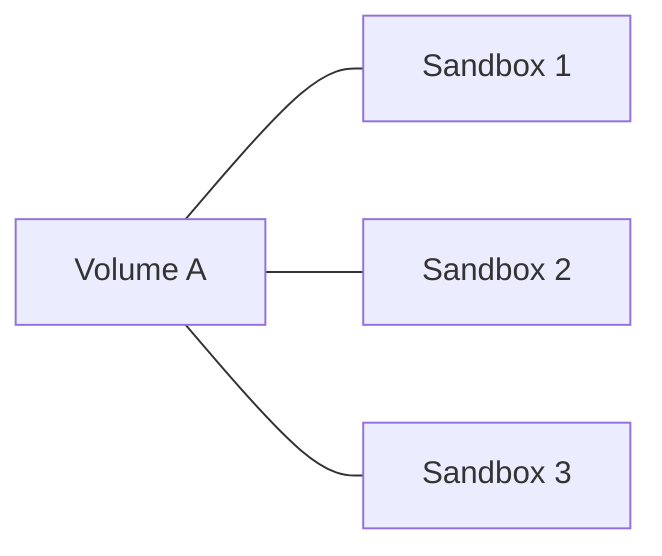
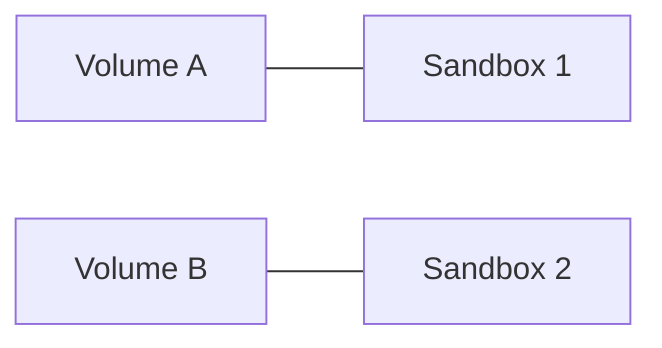
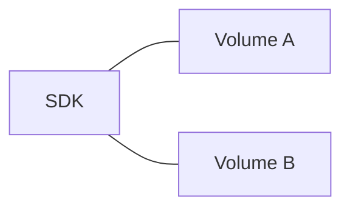

<Note>
Volumes are currently in private beta.
If you'd like access, please reach out to us at [support@e2b.dev](mailto:support@e2b.dev).
</Note>

Volumes provide persistent storage that exists independently of sandbox lifecycles. Data written to a volume persists even after a sandbox is shut down, and volumes can be mounted to multiple sandboxes over time.

**One volume shared across multiple sandboxes**



**Each sandbox with its own volume**



**Standalone usage via SDK**



When a volume is mounted to a sandbox, files can be read and written directly at the mount path. The SDK methods are meant to be used when the volume is not mounted to any sandbox.

With E2B SDK you can:
- [Manage volumes.](/docs/volumes/manage)
- [Mount volumes to sandboxes.](/docs/volumes/mount)
- [Read and write files to a volume.](/docs/volumes/read-write)
- [Get file and directory metadata.](/docs/volumes/info)
- [Upload data to a volume.](/docs/volumes/upload)
- [Download data from a volume.](/docs/volumes/download)

## Example

<CodeGroup>
```js JavaScript & TypeScript
import { Volume, Sandbox } from 'e2b'

const volume = await Volume.create('my-volume')

const sandbox = await Sandbox.create({
  volumeMounts: {
    '/mnt/my-data': volume,
  },
})
```
```python Python
from e2b import Volume, Sandbox

volume = Volume.create('my-volume')

sandbox = Sandbox.create(
    volume_mounts={
        '/mnt/my-data': volume,
    },
)
```
</CodeGroup>
